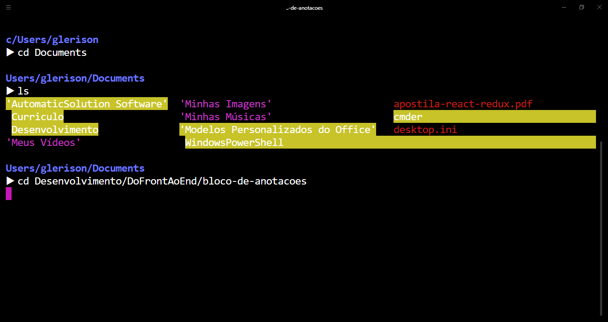

# Outras marcações Markdown não apresentadas na aula

## Tabela
Header 1 | Header 2
-------- | --------
content cell 1 | content cell 2
content cell 1 | content cell 2
```
Header 1 | Header 2
-------- | --------
content cell 1 | content cell 2
content cell 1 | content cell 2
```

## Links
[Github](http://github.com)

[Github Glerison](http://github.com/glerisonlima)

```
[Github](http://github.com)

[Github Glerison](http://github.com/glerisonlima)
```

## Blockquets
>testando blockquets
```
>testando blockquets
```

## Inline code
`<html><h1>Hello Word!</h1></html>`
```
`<html><h1>Hello Word!</h1></html>`
```
## Imagens

```

```
